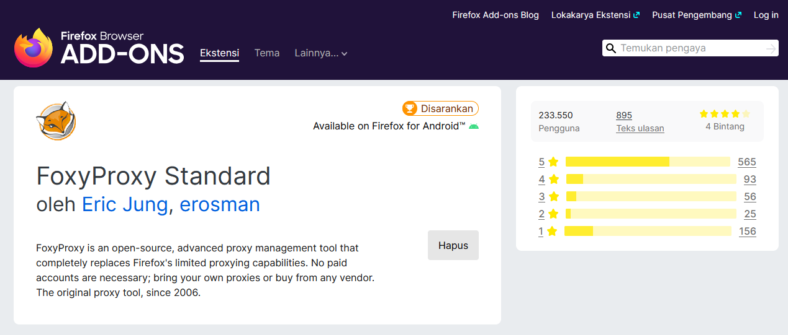
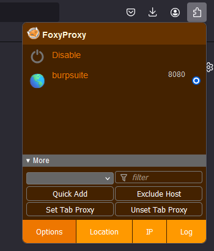
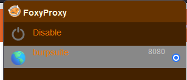
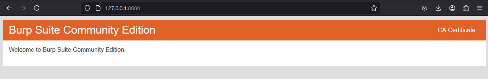
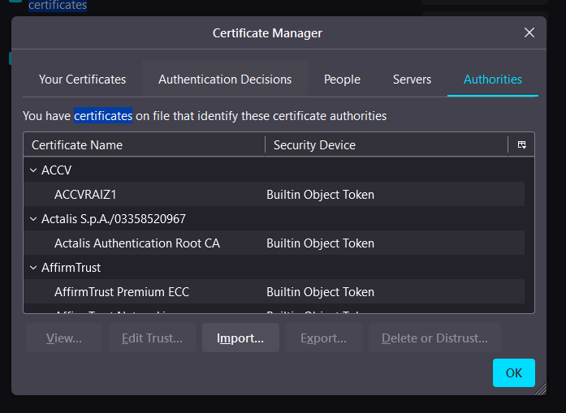
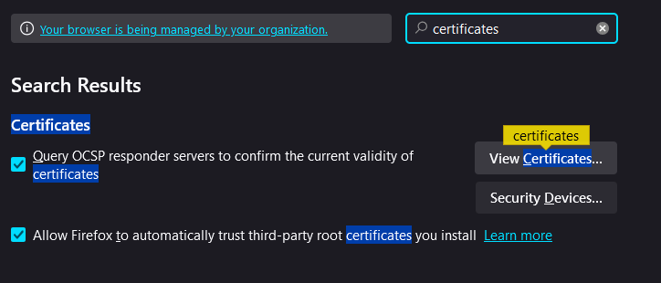
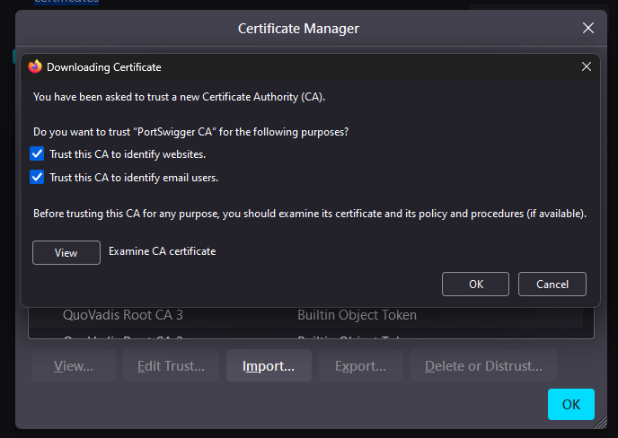

# Konfigurasi FoxyProxy dan Burp Suite di Firefox

## 1. Install FoxyProxy di Firefox:
Buka Firefox, tekan Ctrl+Shift+A untuk membuka **Add-ons**. Cari "FoxyProxy" dan tambahkan ke Firefox.

## 2. Konfigurasi FoxyProxy:
Klik ikon FoxyProxy di toolbar Firefox. Pilih **Options** > klik tombol **Add** untuk menambahkan proxy baru. Isi detailnya sebagai berikut:
- **Title**: Masukkan nama seperti "Burp Suite".
- **Proxy Type**: Pilih **HTTP**.
- **IP Address**: Masukkan 127.0.0.1.
- **Port**: Masukkan 8080 (default port Burp Suite).
Klik **Save** untuk menyimpan pengaturan.

## 3. Aktifkan FoxyProxy:
Klik ikon **FoxyProxy** di toolbar. Pilih konfigurasi **Burp Suite** yang telah dibuat untuk mengaktifkannya.

## 4. Jalankan Burp Suite:
Buka Burp Suite. Pastikan proxy di Burp Suite diatur ke 127.0.0.1:8080.

## 5. Import Sertifikat dari 127.0.0.1:8080:
Buka Firefox dan ketik **http://127.0.0.1:8080** di address bar. Anda akan melihat halaman Burp Suite dengan opsi untuk mengunduh sertifikat CA. Klik **CA Certificate** untuk mengunduh sertifikat.

## 6. Impor Sertifikat ke Firefox:
Buka **Settings** di Firefox. Gulir ke bawah dan klik **Privacy & Security**. Di bagian **Certificates**, klik **View Certificates**. Di tab **Authorities**, klik **Import**. Pilih file sertifikat CA yang telah diunduh dari Burp Suite. Centang dua opsi:
- **Trust this CA to identify websites**.
- **Trust this CA to identify email users** (opsional).
Klik **OK**.

